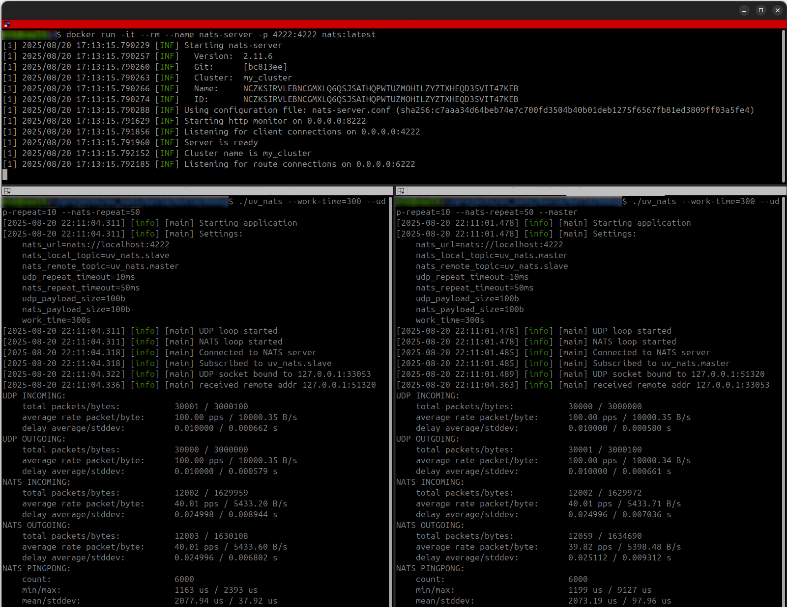

# UV_NATS

Эта программа написана с целью протестировать совместную работу библиотек 
[nats.c](https://github.com/nats-io/nats.c) и [libuv](https://github.com/libuv/libuv).

В рамках программы запускается два потока с двумя циклами libuv, в одном происходит работа с UDP-пакетами, в другом - с NATS-сообщениями.
Поскольку архитектурно nats.c передаёт сообщения в своих потоках, сообщения передаются в цикл libuv через потокобезопасную очередь.

Предполагается, что программа будет запускаться в двух экземплярах, один из которых в режиме мастера. 
После запуска каждая программа создаёт UDP-сокет, адресом которого обменивается с другим экземпляром через NATS.
Как только получен адрес удалённого UDP-сокета начинается обмен UDP-пакетами и NATS-сообщениями.

Обмен UDP-пакетами заключается в отправке по таймеру пакетов определённого размера, а также приём и учёт статистики всех входящих и исходящих пакетов.

Обмен NATS-сообщениями происходит в формате ping-pong. Программа отправляет ping-сообщение и ждёт ответа. 
В случае получения ping-сообщения тут же в ответ отправляется pong-сообщение. 
Ведётся статистика времени запрос-ответ, а также статистика всех входящих и исходящих сообщений.

## Инструкции по сборке Ubuntu 24.04+

### Подготовка к сборке

```bash
python3 -m venv env
source env/bin/activate
pip install conan
conan profile detect --force
conan install . --output-folder=build --build=missing
```

### Сборка

```bash
cmake .. -DCMAKE_TOOLCHAIN_FILE=conan_toolchain.cmake
cmake --build .
```

## Пример запуска

Для запуска потребуется 3 терминала. 
В одном будет работать NATS-сервер в docker-контейнере, в двух других - два экземпляра программы.

Запуск сервера NATS:
```bash
docker run -it --rm --name nats-server -p 4222:4222 -p 8222:8222 nats:latest
```
добавьте -D или -DV, если нужно увидеть подробные логи.

Запуск программ

Мастер:
```bash
./uv_nats --work-time=300 --udp-repeat=10 --nats-repeat=50 --udp-payload=1000 --nats-payload=200 --master
```
и не мастер:
```bash
./uv_nats --work-time=300 --udp-repeat=10 --nats-repeat=50 --udp-payload=1000 --nats-payload=200
```
Аргументы означают, что UDP пакет размера 1000 будет передаваться каждые 10 миллисекунд, 
а NATS-сообщения ping будут передаваться каждые 50 миллисекунд и в их тело будет добавляться нагрузка в 200 байт.

